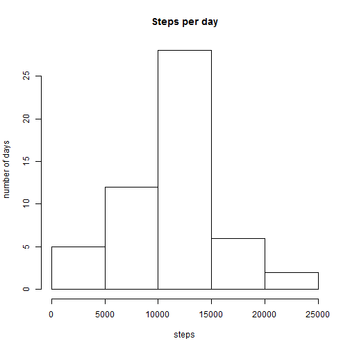
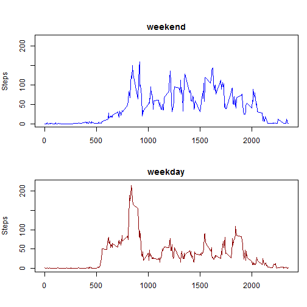

# Reproducible Research: Peer Assessment 1


## Loading and preprocessing the data
1. Load the data (i.e. read.csv()).
2. Process/transform the data.
3. Calculate the total number of steps taken per day.


```r
steps<-read.csv("activity.csv")
totalSteps <- aggregate(steps ~ date, data = steps, sum, na.rm = TRUE)
```

## What is mean total number of steps taken per day?
1. Make a histogram of the total number of steps taken each day.
2. Mean and median of the total number of steps taken per day

```r
hist(totalSteps$steps, main="Steps per day", xla="steps", yla="number of days")
```



```r
mean(stepdays, na.rm=T)
```

```
## [1] 10766.19
```

```r
median(stepdays, na.rm=T)
```

```
## [1] 10765
```

## What is the average daily activity pattern?

1. Make a time series plot (i.e. type = "l") of the 5-minute interval (x-axis) and the average number of steps taken, averaged across all days (y-axis)
2. Which 5-minute interval, on average across all the days in the dataset, contains the maximum number of steps?

```r
stepsInterval <- aggregate(steps ~ interval, data = steps, mean, na.rm = TRUE)
plot(steps ~ interval, data = stepsInterval, type = "l")
```


```r
stepsInterval[which.max(stepsInterval$steps), ]$interval
```

```
## [1] 835
```

## Imputing missing values

1. Calculate and report the total number of missing values in the dataset (i.e. the total number of rows with NAs)
2. Devise a strategy for filling in all of the missing values in the dataset. The strategy does not need to be sophisticated. For example, you could use the mean/median for that day, or the mean for that 5-minute interval, etc.
3. Create a new dataset that is equal to the original dataset but with the missing data filled in.
4. Make a histogram of the total number of steps taken each day and Calculate and report the mean and median total number of steps taken per day. Do these values differ from the estimates from the first part of the assignment? What is the impact of imputing missing data on the estimates of the total daily number of steps?


```r
sum(is.na(steps$steps))
```

```
## [1] 2304
```


```r
interval2steps <- function(interval) {
    stepsInterval[stepsInterval$interval == interval, ]$steps
}
```

Create new dataset using original data and fill the missing values using mean/median for that day. 
  

```r
activityFilled <- steps  # Make a new dataset with the original data
count = 0  # Count the number of data filled in
for (i in 1:nrow(activityFilled)) {
    if (is.na(activityFilled[i, ]$steps)) {
        activityFilled[i, ]$steps <- interval2steps(activityFilled[i, ]$interval)
        count = count + 1
    }
}
cat("Total ", count, "NA values were filled.")
```

```
## Total  2304 NA values were filled.
```


```r
totalSteps2 <- aggregate(steps ~ date, data = activityFilled, sum)
hist(totalSteps2$steps)
```


```r
mean(totalSteps2$steps)
```

```
## [1] 10766.19
```

```r
median(totalSteps2$steps)
```

```
## [1] 10766.19
```

## Are there differences in activity patterns between weekdays and weekends?
1. Create a new factor variable in the dataset with two levels - "weekday" and "weekend" indicating whether a given date is a weekday or weekend day.
2. Make a panel plot containing a time series plot (i.e. type = "l") of the 5-minute interval (x-axis) and the average number of steps taken, averaged across all weekday days or weekend days (y-axis). See the README file in the GitHub repository to see an example of what this plot should look like using simulated data.

First, convert the date variable from factor to string, and then to a date object. Then we can get weekday/weekend status. 


```r
steps$ddate<-as.character(steps$date)
steps$ddate<-as.Date(steps$ddate, format="%Y-%m-%d")
steps$weekday<-weekdays(steps$ddate)
steps$weekend<-F
steps$weekend[steps$weekday %in% c("Saturday", "Sunday")]<-T

steps.i.weekdays<-aggregate(steps$steps[!steps$weekend], list(steps$interval[!steps$weekend]), mean, na.rm=T)
steps.i.weekends<-aggregate(steps$steps[steps$weekend], list(steps$interval[steps$weekend]), mean, na.rm=T)
names(stepmin.i.weekdays)<-c("interval", "steps")
names(stepmin.i.weekends)<-c("interval", "steps")


par(mfrow = c(2,1), mar = c(4, 4, 2, 1), oma = c(0, 0, 2, 0))
plot(stepmin.i.weekends$interval, stepmin.i.weekends$steps, pch="", ylab="Steps", xlab="", main="weekend", type="l", ylim=c(0,220), col="blue")
plot(stepmin.i.weekdays$interval, stepmin.i.weekdays$steps, pch="", ylab="Steps", xlab="", main="weekday", type="l",  ylim=c(0,220), col="darkred")
```



